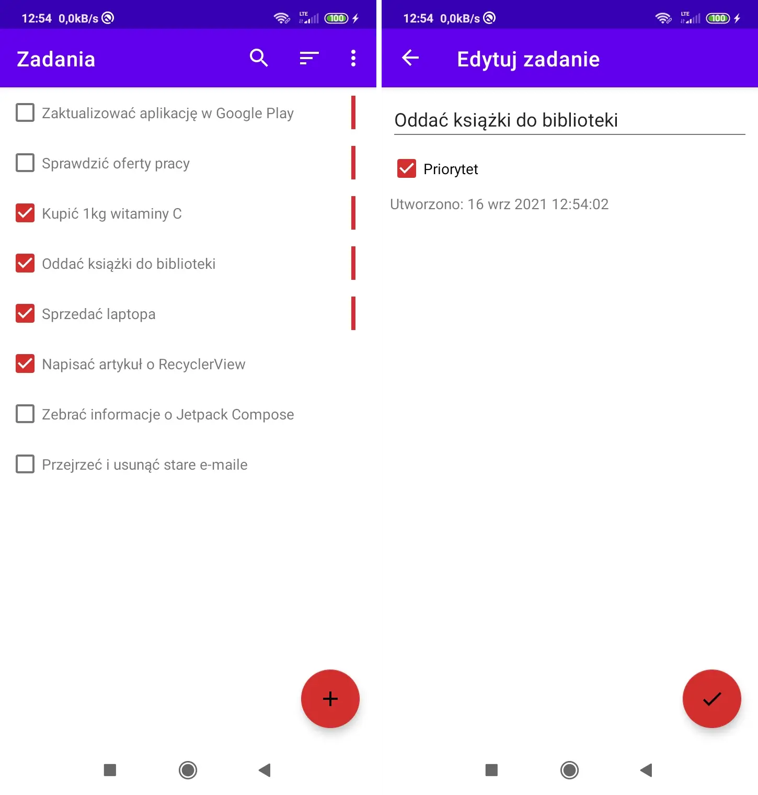

# Zadania

Zadania to aplikacja mobilna Android napisana w języku Kotlin, która w 95% oparta jest na dostępnym w YouTube tutorialu autorstwa Coding in Flow. Aplikacja pozwala nadzorować zadania do zrobienia; można oznaczać je jako priorytetowe, a także sortować i filtrować.

Oryginalna wersja:
- repozytorium GitHub: [MVVMTodo](https://github.com/codinginflow/MVVMTodo),
- playlista YouTube: [MVVM To-Do List App with Flow and Architecture Components](https://www.youtube.com/playlist?list=PLrnPJCHvNZuCfAe7QK2BoMPkv2TGM_b0E).

Użyte technologie:
- MVVM (ViewModel),
- LiveData,
- View Binding,
- Navigation Component,
- Dagger Hilt,
- Room (SQLite),
- Jetpack DataStore,
- Flow (Coroutines).

Główne różnice:
- oryginalną wersję opublikowano w listopadzie-grudniu 2020 roku, a tę napisano w lipcu-sierpniu 2021 roku,
- zawarto nieco inne zależności - chociaż w efekcie niektóre np. adnotacje i tak są już zdeprecjonowane,
- użyto findViewById() zamiast View Binding,
- spolszczono i nieznacznie ulepszono interfejs użytkownika.

Aplikacja powstała w celach edukacyjnych. Nie jest wydana w Google Play ani gdziekolwiek indziej. Nie są planowane jej aktualizacje. To repozytorium istnieje wyłącznie w celach referencyjnych i odpowiada tylko na najważniejsze pytanie: jak coś w Androidzie zrobić dobrze?

